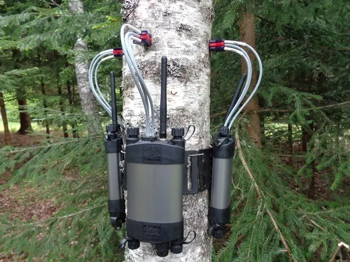

```{r chunk-load-packages, include=FALSE}
library(tidyverse)
library(tidymodels)
library(knitr)
library(kableExtra)
library(xaringanthemer)
library(lubridate)
```


```{r chunk-setup, include=FALSE}
knitr::opts_chunk$set(fig.retina = 1, dpi = 100, fig.width = 6, fig.asp = 0.5, out.width = "100%")
```

```{r process-data, include=FALSE}
if (!file.exists("/cloud/project/project-starter/data/sapflow_daily.rds")) {
  data_folder <- "/cloud/project/project-starter/data"
  file_list <- list.files(path = data_folder, pattern = "*.csv", full.names = TRUE, recursive = TRUE)
  sapflow_daily <- file_list |>
    map(\(filepath) {
      df <- read_csv(filepath, show_col_types = FALSE)
      if (!"Sensor Data" %in% names(df)) {
        df <- df |> pivot_longer(cols = -Timestamp, names_to = "Sensor Data", values_to = "Value")
      }
      df |>
        filter(`Sensor Data` %in% c("uncorrected_inner (cm/hr)", "uncorrected_outer (cm/hr)")) |>
        mutate(
          site    = str_extract(filepath, "(?<=data/)[^/]+"),
          tree_id = str_remove(basename(filepath), "\\.csv$"),
          species = str_remove(tree_id, "-[^-]+$") |> str_replace_all("_", " "),
          date    = as_date(ymd_hms(Timestamp))
        ) |>
        group_by(site, tree_id, species, date, `Sensor Data`) |>
        summarise(daily_mean = mean(Value, na.rm = TRUE), .groups = "drop")
    }) |>
    list_rbind() |>
    filter(site != "NEIU")
  saveRDS(sapflow_daily, "/cloud/project/project-starter/data/sapflow_daily.rds")
}
```

```{r load-data, include=FALSE}
sapflow_daily <- readRDS("/cloud/project/project-starter/data/sapflow_daily.rds")
```

```{r model-data, include=FALSE}
sapflow_inner <- sapflow_daily |>
  filter(`Sensor Data` == "uncorrected_inner (cm/hr)")

sapflow_outer <- sapflow_daily |>
  filter(`Sensor Data` == "uncorrected_outer (cm/hr)")

lm_inner <- lm(daily_mean ~ species + site, data = sapflow_inner)
lm_outer <- lm(daily_mean ~ species + site, data = sapflow_outer)
```


class: center, middle

## Research Questions

- Do sapflow rates differ between urban tree species in Chicago?

- How does the site location affect sapflow rates across species? 

- Are there consistent patterns across the data between species and sites?
---

# Background

- Sapflow is the movement of water and nutrients through a plant's tissue, in this case trees 

- Learning the difference in sapflow rates between tree species and sites can tell us a lot about the environments they need to thrive, and whether or not that is being provided.

- Data collected across 4 sites in Chicago: **CSU, NU, NEIU(omitted) and UIC**

- **16 trees** across **5 species**: American Elm, Cottonwood, Honey Locust, Maple, and Oak

- Two sensors per tree: inner and outer sapflow (cm/hr)

---

# Data
.pull-left[
- Retrieved data from a CROCUS node dashboard.

- Data was originally obtained through sapflow sensors with probes placed inside trees 

- April 1, 2026 - April 30, 2026

- Trees at NEIU were unique to that location, so they could not be compared to trees of the same species from other locations

- Several sensors were offline and their data could not be retrieved 
]
.pull-right[
```{r load-image, echo=FALSE}

```
]
---

class: inverse, center, middle

# Exploratory Analysis

---

# Sapflow Over Time by Species

```{r timeseries-plot, fig.width=10, fig.height=7, echo=FALSE, warning=FALSE, message=FALSE}
sapflow_daily |>
  ggplot(aes(x = date, y = daily_mean, color = tree_id, linetype = `Sensor Data`)) +
  geom_line(alpha = 0.7) +
  facet_wrap(~ species, ncol = 2) +
  scale_linetype_manual(
    values = c("uncorrected_inner (cm/hr)" = "solid", "uncorrected_outer (cm/hr)" = "dashed"),
    labels = c("uncorrected_inner (cm/hr)" = "Inner", "uncorrected_outer (cm/hr)" = "Outer")
  ) +
  labs(
    title    = "Daily Average Sapflow by Species Over Time",
    x        = "Date",
    y        = "Sapflow (cm/hr)",
    color    = "Tree",
    linetype = "Sensor"
  ) +
  theme_minimal() +
  theme(
    legend.position = "bottom",
    text            = element_text(size = 12),
    strip.text      = element_text(size = 12)
  )
```

---

class: inverse, center, middle

# Summary Statistics

---

# Sapflow by Species and Site

```{r summary-table, echo=FALSE, warning=FALSE, message=FALSE}
sapflow_daily |>
  group_by(species, site, `Sensor Data`) |>
  summarise(
    mean    = round(mean(daily_mean, na.rm = TRUE), 3),
    sd      = round(sd(daily_mean,   na.rm = TRUE), 3),
    min     = round(min(daily_mean,  na.rm = TRUE), 3),
    max     = round(max(daily_mean,  na.rm = TRUE), 3),
    .groups = "drop"
  ) |>
  rename(
    Species   = species,
    Site      = site,
    Sensor    = `Sensor Data`,
    Mean      = mean,
    `Std Dev` = sd,
    Min       = min,
    Max       = max
  ) |>
  select(Site, Species, Sensor, Mean, `Std Dev`, Min, Max) |>
  kable(format = "html", caption = "Summary Statistics of Daily Average Sapflow by Species and Site") |>
  kable_styling(font_size = 11)
```

---

class: inverse, center, middle

# Linear Models

---

# Does Species and Site Predict Sapflow?

.pull-left[
**Inner Sensor**
- **Maple** and **Oak** significantly higher than American Elm
- **Cottonwood** significantly lower than American Elm
- **NU** significantly lower, **UIC** significantly higher than CSU
- R² = 0.33
]

.pull-right[
**Outer Sensor**
- **Cottonwood** significantly higher than American Elm
- **Honey Locust, Maple, Oak** not significant
- **NU** significantly lower, **UIC** significantly higher than CSU
- R² = 0.28
]

---

# Inner Sensor Model Results

```{r lm-inner-table, echo=FALSE, warning=FALSE, message=FALSE}
tidy(lm_inner, conf.int = TRUE) |>
  filter(term != "(Intercept)") |>
  mutate(
    term      = str_remove(term, "^species|^site"),
    group     = if_else(term %in% c("NU", "UIC"), "Site", "Species"),
    estimate  = round(estimate, 3),
    std.error = round(std.error, 3),
    p.value   = round(p.value, 4)
  ) |>
  rename(
    Term        = term,
    Group       = group,
    Estimate    = estimate,
    `Std Error` = std.error,
    `P-value`   = p.value
  ) |>
  select(Group, Term, Estimate, `Std Error`, `P-value`) |>
  arrange(Group, Term) |>
  kable(format = "html", caption = "Inner Sensor: Effect of Species and Site on Sapflow (relative to American Elm at CSU)") |>
  kable_styling()
```

---

# Outer Sensor Model Results

```{r lm-outer-table, echo=FALSE, warning=FALSE, message=FALSE}
tidy(lm_outer, conf.int = TRUE) |>
  filter(term != "(Intercept)") |>
  mutate(
    term      = str_remove(term, "^species|^site"),
    group     = if_else(term %in% c("NU", "UIC"), "Site", "Species"),
    estimate  = round(estimate, 3),
    std.error = round(std.error, 3),
    p.value   = round(p.value, 4)
  ) |>
  rename(
    Term        = term,
    Group       = group,
    Estimate    = estimate,
    `Std Error` = std.error,
    `P-value`   = p.value
  ) |>
  select(Group, Term, Estimate, `Std Error`, `P-value`) |>
  arrange(Group, Term) |>
  kable(format = "html", caption = "Outer Sensor: Effect of Species and Site on Sapflow (relative to American Elm at CSU)") |>
  kable_styling()
```

---

# Sapflow Distribution by Species and Site

```{r boxplot-site, fig.width=10, fig.height=6, echo=FALSE, warning=FALSE, message=FALSE}
sapflow_daily |>
  ggplot(aes(x = species, y = daily_mean, fill = site)) +
  geom_boxplot(alpha = 0.7) +
  facet_wrap(~ `Sensor Data`, ncol = 1,
             labeller = labeller(`Sensor Data` = c(
               "uncorrected_inner (cm/hr)" = "Inner Sensor",
               "uncorrected_outer (cm/hr)" = "Outer Sensor"
             ))) +
  labs(
    title = "Sapflow Distribution by Species and Site",
    x     = "Species",
    y     = "Daily Mean Sapflow (cm/hr)",
    fill  = "Site"
  ) +
  theme_minimal() +
  theme(
    legend.position = "bottom",
    text            = element_text(size = 12),
    strip.text      = element_text(size = 12),
    axis.text.x     = element_text(angle = 25, hjust = 1)
  )
```

---

# Conclusions

- Sapflow rates differ significantly between species and site — linear models show that species and site together explain 28-33% of the variation in sapflow (R² = 0.28-0.33), with site location having a consistent effect across both sensors

- Inner and outer sensors tell different stories — Cottonwood shows opposite patterns between sensors (higher outer, lower inner), while Maple and Oak are only significantly higher than American Elm in the inner sensor, suggesting the two sensors capture different aspects of water movement


- Site matters as much as species — NU trees consistently show lower sapflow than CSU across all species and both sensors, while UIC trees show higher sapflow, indicating that local environmental conditions at each site play a significant role in tree water use