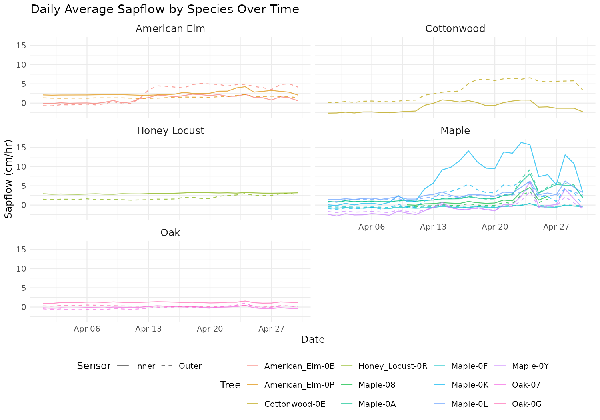
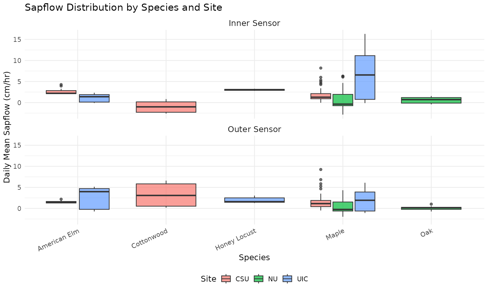

```{r chunk-load-packages, include=FALSE}
library(tidyverse)
library(tidymodels)
library(knitr)
library(xaringanthemer)
library(lubridate)
```

```{r chunk-setup, include=FALSE}
knitr::opts_chunk$set(cache = FALSE)
```

```{r chunk-process-data, include=FALSE}
if (!file.exists("/cloud/project/project-starter/data/sapflow_daily.rds")) {
  data_folder <- "/cloud/project/project-starter/data"
  file_list <- list.files(path = data_folder, pattern = "*.csv", full.names = TRUE, recursive = TRUE)
  sapflow_daily <- file_list |>
    map(\(filepath) {
      df <- read_csv(filepath, show_col_types = FALSE)
      if (!"Sensor Data" %in% names(df)) {
        df <- df |> pivot_longer(cols = -Timestamp, names_to = "Sensor Data", values_to = "Value")
      }
      df |>
        filter(`Sensor Data` %in% c("uncorrected_inner (cm/hr)", "uncorrected_outer (cm/hr)")) |>
        mutate(
          site    = str_extract(filepath, "(?<=data/)[^/]+"),
          tree_id = str_remove(basename(filepath), "\\.csv$"),
          species = str_remove(tree_id, "-[^-]+$") |> str_replace_all("_", " "),
          date    = as_date(ymd_hms(Timestamp))
        ) |>
        group_by(site, tree_id, species, date, `Sensor Data`) |>
        summarise(daily_mean = mean(Value, na.rm = TRUE), .groups = "drop")
    }) |>
    list_rbind() |>
    filter(site != "NEIU")
  saveRDS(sapflow_daily, "/cloud/project/project-starter/data/sapflow_daily.rds")
}
```

```{r chunk-load-data, include=FALSE}
sapflow_daily <- readRDS("/cloud/project/project-starter/data/sapflow_daily.rds")
```

```{r chunk-model-data, include=FALSE}
sapflow_inner <- sapflow_daily |>
  filter(`Sensor Data` == "uncorrected_inner (cm/hr)")

sapflow_outer <- sapflow_daily |>
  filter(`Sensor Data` == "uncorrected_outer (cm/hr)")

lm_inner <- lm(daily_mean ~ species + site, data = sapflow_inner)
lm_outer <- lm(daily_mean ~ species + site, data = sapflow_outer)
```

---

class: center, middle

## Does sapflow rate differ between urban tree species across Chicago?

---

# Background

- [What is sapflow? Brief explanation here]

- [Why does it matter in an urban environment?]

- Data collected across 3 sites in Chicago: **CSU, NU, and UIC**

- **12 trees** across **5 species**: American Elm, Cottonwood, Honey Locust, Maple, and Oak

- Two sensors per tree: inner and outer sapflow (cm/hr)

---

# Data

- [Brief description of where the data came from]

- [Time period covered]

- [Any notes on data quality or processing decisions]

---

class: inverse, center, middle

# Exploratory Analysis

---

# Sapflow Over Time by Species

```{r chunk-timeseries-plot, echo=FALSE}

```

---

class: inverse, center, middle

# Summary Statistics

---

# Sapflow by Species and Site

```{r chunk-summary-table, echo=FALSE, warning=FALSE, message=FALSE}
sapflow_daily |>
  group_by(species, site, `Sensor Data`) |>
  summarise(
    mean    = round(mean(daily_mean, na.rm = TRUE), 3),
    sd      = round(sd(daily_mean,   na.rm = TRUE), 3),
    min     = round(min(daily_mean,  na.rm = TRUE), 3),
    max     = round(max(daily_mean,  na.rm = TRUE), 3),
    .groups = "drop"
  ) |>
  rename(
    Species   = species,
    Site      = site,
    Sensor    = `Sensor Data`,
    Mean      = mean,
    `Std Dev` = sd,
    Min       = min,
    Max       = max
  ) |>
  select(Site, Species, Sensor, Mean, `Std Dev`, Min, Max) |>
  kable(format = "html", caption = "Summary Statistics of Daily Average Sapflow by Species and Site")
```

---

class: inverse, center, middle

# Linear Models

---

# Does Species and Site Predict Sapflow?

.pull-left[
**Inner Sensor**
- **Maple** and **Oak** significantly higher than American Elm
- **Cottonwood** significantly lower than American Elm
- **NU** significantly lower, **UIC** significantly higher than CSU
- R² = 0.33
]

.pull-right[
**Outer Sensor**
- **Cottonwood** significantly higher than American Elm
- **Honey Locust, Maple, Oak** not significant
- **NU** significantly lower, **UIC** significantly higher than CSU
- R² = 0.28
]

---

# Inner Sensor Model Results

```{r chunk-lm-inner-table, echo=FALSE, warning=FALSE, message=FALSE}
tidy(lm_inner, conf.int = TRUE) |>
  filter(term != "(Intercept)") |>
  mutate(
    term      = str_remove(term, "^species|^site"),
    group     = if_else(term %in% c("NU", "UIC"), "Site", "Species"),
    estimate  = round(estimate, 3),
    std.error = round(std.error, 3),
    p.value   = round(p.value, 4)
  ) |>
  rename(
    Term        = term,
    Group       = group,
    Estimate    = estimate,
    `Std Error` = std.error,
    `P-value`   = p.value
  ) |>
  select(Group, Term, Estimate, `Std Error`, `P-value`) |>
  arrange(Group, Term) |>
  kable(format = "html", caption = "Inner Sensor: Effect of Species and Site on Sapflow (relative to American Elm at CSU)")
```

---

# Outer Sensor Model Results

```{r chunk-lm-outer-table, echo=FALSE, warning=FALSE, message=FALSE}
tidy(lm_outer, conf.int = TRUE) |>
  filter(term != "(Intercept)") |>
  mutate(
    term      = str_remove(term, "^species|^site"),
    group     = if_else(term %in% c("NU", "UIC"), "Site", "Species"),
    estimate  = round(estimate, 3),
    std.error = round(std.error, 3),
    p.value   = round(p.value, 4)
  ) |>
  rename(
    Term        = term,
    Group       = group,
    Estimate    = estimate,
    `Std Error` = std.error,
    `P-value`   = p.value
  ) |>
  select(Group, Term, Estimate, `Std Error`, `P-value`) |>
  arrange(Group, Term) |>
  kable(format = "html", caption = "Outer Sensor: Effect of Species and Site on Sapflow (relative to American Elm at CSU)")
```

---

# Sapflow Distribution by Species and Site

```{r chunk-boxplot-site, echo=FALSE}

```

---

# Conclusions

- [Key finding 1]

- [Key finding 2]

- [Key finding 3]